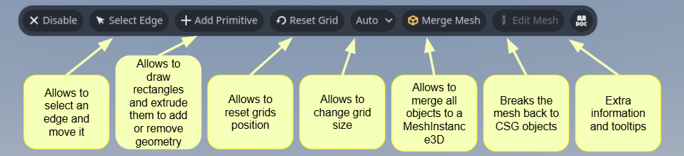

# BoxConstructor
 Easy-to-use Grayboxing tool for Godot.

## Overview
BoxConstructor is a Godot plugin designed for fast and efficient 3D prototyping directly within the editor. It features a grid-based system for block placement, extrusion, and cutting, enabling quick iteration of 3D layouts.

## Installation
1. Download or clone this repository.
2. Copy the `addons` folder into your Godot project's root directory.
3. In your Godot editor go to `Project` → `Project Settings` → `Plugins`.
4. Find `BoxConstructor` in the plugin list and enable it by checking the box.

Your directory structure should look like this:
```
your-project/
└── addons/
    └── BoxConstructor/
        └── plugin files...
```

## Usage
1. Create a new scene.
2. Add a Node3D to your scene.
3. Add a child node named CubeGrid3D.

## Feature overview

### Extrusion
User can extrude cubes by:
1. Selecting Add Primitive from the toolbar.
2. Clicking to start drawing the base rectangle.
3. Clicking again to finalize the base rectangle, which then enters extrusion mode.
4. Moving the mouse to set the desired extrusion depth.
5. Clicking once more to finalize the extrusion.


Depending on the extrusion direction:
- Extrusion along the surface normal adds geometry.
- Extrusion in the opposite direction removes geometry.

### Example of a cut operation:

### Result of the cut operation:


## Plane movement
The drawing plane can be snapped to a face by pressing the X key while the mouse is over the face.

You can reset the plane's transform by selecting Reset Grid on the toolbar.

